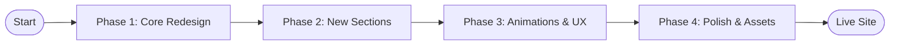
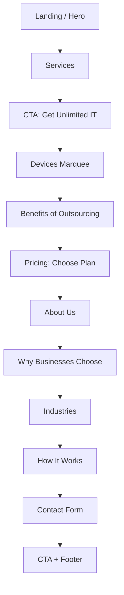
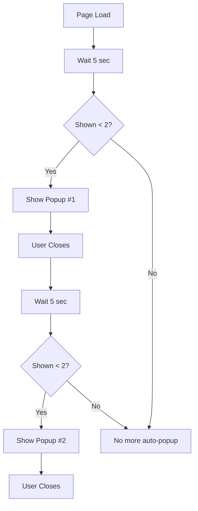
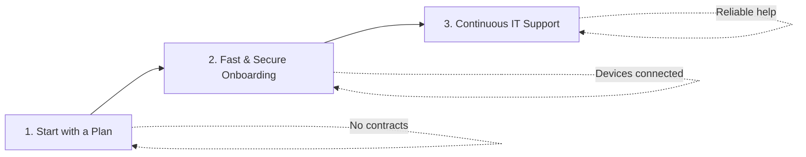
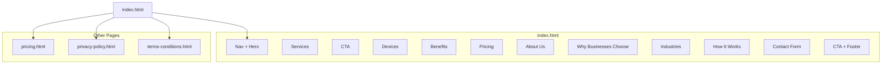
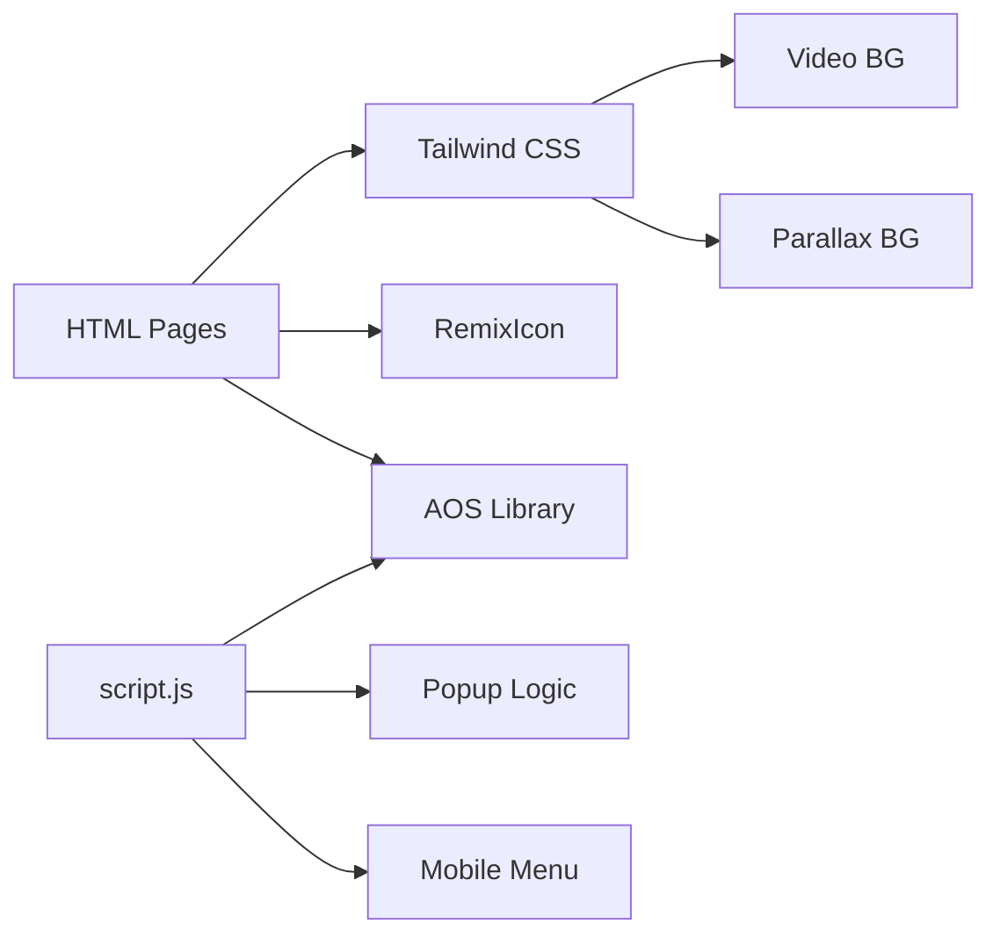
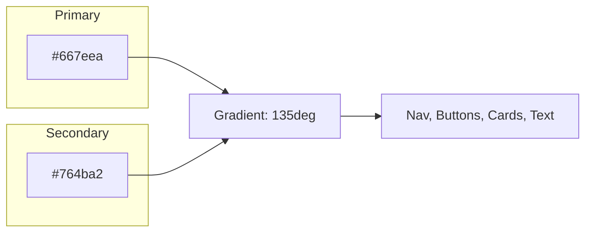

# GeekSupport Website

A modern, professional website for **GeekSupport** — complete IT support for small to medium organizations. Built with HTML, Tailwind CSS, and JavaScript. This README documents the project from **start to end**, including flowcharts and diagrams.

---

## 📑 Table of Contents

1. [Overview](#-overview)
2. [Features at a Glance](#-features-at-a-glance)
3. [Work Done (Changelog – Start to Present)](#-work-done-changelog--start-to-present)
4. [Flowcharts & Diagrams](#-flowcharts--diagrams)
5. [Project Structure](#-project-structure)
6. [Key Sections (Homepage Order)](#-key-sections-homepage-order)
7. [Tech Stack](#-tech-stack)
8. [Run Locally](#-run-locally)
9. [Content & License](#-content--license)

---

## 📌 Overview

| Item | Description |
|------|-------------|
| **Project** | GeekSupport marketing & information website |
| **Purpose** | Showcase IT support services, pricing, and drive contact/consultation |
| **Stack** | HTML5, Tailwind CSS (CDN), Vanilla JavaScript, RemixIcon, AOS |
| **Pages** | Home (`index.html`), Pricing (`pricing.html`), Privacy Policy (`privacy-policy.html`), Terms & Conditions (`terms-conditions.html`) |

---

## ✨ Features at a Glance

- **Hero** with video background and gradient overlay  
- **Sticky navbar** with glassmorphism and logo zoom animation  
- **AOS** (Animate On Scroll) on sections and cards  
- **Consultation popup** — auto-shows twice (5s after load, then 5s after first close)  
- **Responsive** layout and mobile menu  
- **Parallax** backgrounds (About, Industries, Benefits)  
- **Pricing cards** and full pricing/features table on `pricing.html`  
- **Contact form** (Web3Forms) and back-to-top button  

---

## 📋 Work Done (Changelog – Start to Present)

### Phase 1: Core Redesign
- **Hero**: Video background (`IMAGE/baner.mp4`), dark overlay, CTA buttons  
- **Navigation**: Glassmorphism navbar, clickable phone links, blue–purple gradient call button, mobile menu  
- **Pricing Cards**: Three tiers (PremiumMB, Premium, Premium+), simplified layout, brand gradient  
- **Devices Section**: Infinite marquee, 14+ device types, black icons  
- **Industries Section**: Parallax background (`IMAGE/back.png`), industry grid with hover effects  
- **Footer**: SVG pattern background, payment methods, social links  
- **Icons**: Migration from Font Awesome to **RemixIcon**  

### Phase 2: New Sections & Content
- **About Us**: 60% text + 40% “Why Choose GeekSupport?” card; transparent parallax (Unsplash workspace image, `background-attachment: fixed`)  
- **Why Businesses Choose GeekSupport**: 6 benefit cards (No lock-ins, Transparent pricing, Rapid response, Certified specialists, Enterprise security, Modern tools)  
- **How It Works**: 3-step flow (Start with a Plan → Fast & Secure Onboarding → Continuous IT Support); gradient step badges, cards, icons, connector line and arrows on desktop  
- **Benefits of outsourcing**: 6 benefits with parallax (`IMAGE/b2.png`), AOS on heading + cards  
- **Choose the plan that is right for your business**: Pricing section with AOS, 3 cards, “Learn More About Pricing” CTA  

### Phase 3: Animations & UX
- **AOS**: CDN v2.3.1, init in `script.js` (duration 600ms, offset 80px, once). Applied to Services, CTA, Devices, Benefits, Pricing, About Us, Why Businesses Choose, Industries, How It Works, Contact Form  
- **Navbar logo**: Zoom in/out animation (`.logo-zoom`, 3s ease-in-out infinite)  
- **Contact / Consultation popup**: Auto-show 2 times — first 5s after page load; after close, second popup 5s later; max 2 per session  

### Phase 4: Polish & Assets
- About Us parallax: Unsplash workspace image  
- How It Works: gradient step numbers (blue–purple), shadow  
- **Assets**: `IMAGE/back.png`, `IMAGE/b2.png`, `IMAGE/baner.mp4`, `IMAGE/terms.jpg`, `IMAGE/logo.png`, `IMAGE/privacy vdo.mp4`  

---

## 🗺️ Flowcharts & Diagrams

### 1. Project Flow (Start → End)



### 2. Homepage Section Flow (User Journey)



### 3. Contact Popup Auto-Show Flow



### 4. How It Works – 3 Steps



### 5. Site Structure (Pages & Navigation)



### 6. Tech Stack & Dependencies



### 7. Brand Colors (Design System)



---

## 📁 Project Structure

```
geek s/
├── index.html              # Main homepage (all sections)
├── pricing.html            # Pricing & features page
├── privacy-policy.html     # Privacy policy
├── terms-conditions.html   # Terms and conditions
├── script.js               # AOS init, popup, menu, forms, back-to-top
├── README.md               # This file
└── IMAGE/
    ├── logo.png            # Navbar & footer logo
    ├── baner.mp4           # Hero video background
    ├── back.png            # Industries / parallax background
    ├── b2.png              # Benefits section parallax
    ├── terms.jpg           # Terms page asset
    └── privacy vdo.mp4     # Privacy page video
```

---

## ✨ Key Sections (Homepage Order)

| # | Section | Notes |
|---|--------|-------|
| 1 | Navigation | Sticky, glassmorphism, logo zoom, gradient call button |
| 2 | Hero | Video background, overlay, CTAs |
| 3 | Services | 3 pillars, AOS fade-up |
| 4 | CTA | Get Unlimited IT Support |
| 5 | Devices | Infinite marquee, 14+ types |
| 6 | Benefits | 6 benefits, parallax (b2.png), AOS |
| 7 | Pricing | 3 cards, AOS, link to pricing.html |
| 8 | About Us | 60% parallax (Unsplash) + 40% Why Choose, AOS |
| 9 | Why Businesses Choose | 6 cards, AOS |
| 10 | Industries | Parallax (back.png), AOS |
| 11 | How It Works | 3 steps, gradient badges, AOS |
| 12 | Contact Form | AOS; popup auto-shows 2× (5s delay) |
| 13 | CTA + Footer | Pattern background, links to Privacy & Terms |

---

## 🛠️ Tech Stack

| Layer | Technology |
|-------|------------|
| Markup | HTML5 (semantic) |
| Styling | Tailwind CSS (CDN) |
| Script | Vanilla JavaScript |
| Icons | RemixIcon v4.1.0 |
| Animations | AOS v2.3.1 (CDN) |
| Media | HTML5 video, parallax images |
| Forms | Web3Forms (access key in form) |

---

## 🚀 Run Locally

1. Clone or download the project.  
2. Open `index.html` in a browser (no build step).  
3. **Popup**: Wait 5s for first consultation popup; close it, wait 5s for the second.  

---

## 📄 Content & License

Content inspired by GeekSupport (geeksupport.com). All rights reserved by original copyright holders.

---

**README** — Documents the project from start to end, with flowcharts and diagrams. Last updated with full project flow and design-system diagram.
