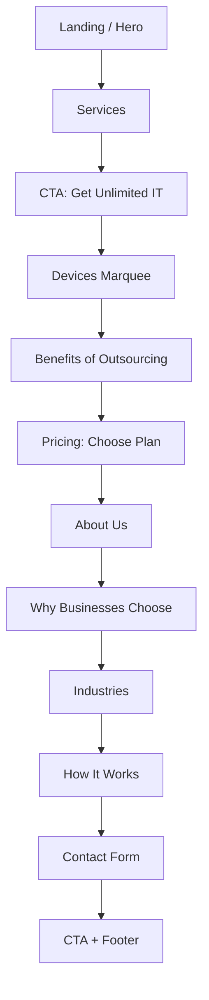
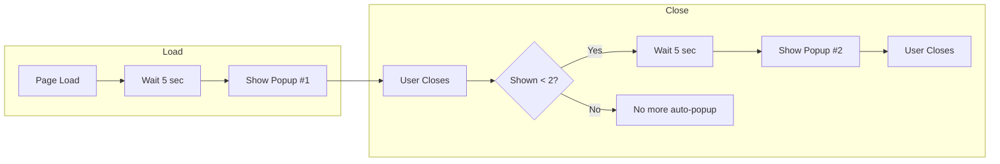
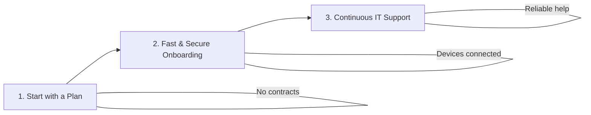
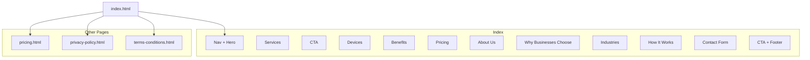
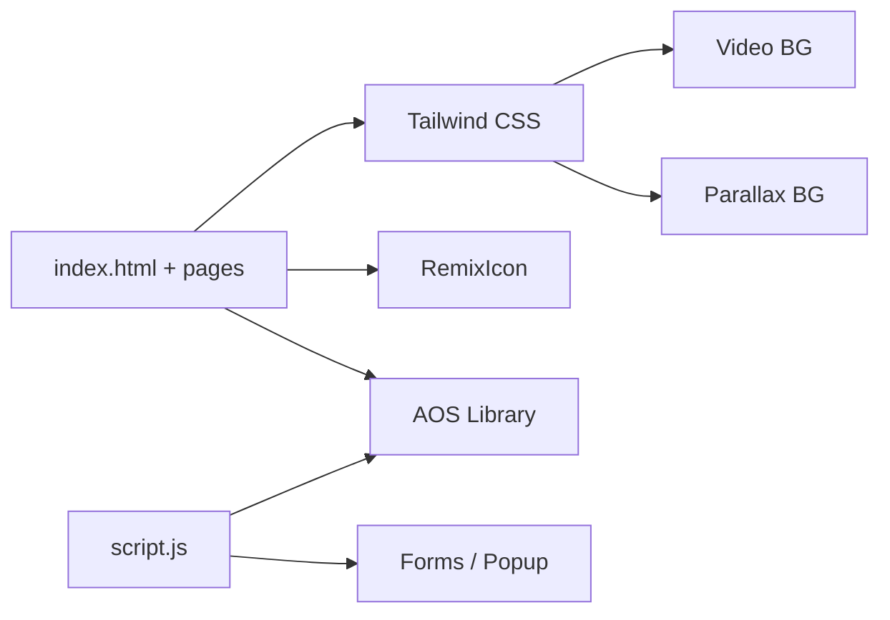

# GeekSupport Website

A modern, professional website for GeekSupport — complete IT support for small to medium organizations. Built with HTML, Tailwind CSS, and JavaScript.

---

## 📋 Work Done (Changelog – Start to Present)

### Phase 1: Core Redesign
- **Hero**: Video background (`IMAGE/baner.mp4`), dark overlay, CTA buttons
- **Navigation**: Glassmorphism navbar, clickable phone links, blue–purple gradient call button, mobile menu
- **Pricing Cards**: Three tiers (PremiumMB, Premium, Premium+), simplified layout, brand gradient
- **Devices Section**: Infinite marquee, 14+ device types, black icons
- **Industries Section**: Parallax background (`IMAGE/back.png`), industry grid with hover effects
- **Footer**: SVG pattern background, payment methods, social links
- **Icons**: Migration from Font Awesome to **RemixIcon**

### Phase 2: New Sections & Content
- **About Us**: 60% text + 40% “Why Choose GeekSupport?” card; **transparent parallax background** in 60% area (Unsplash workspace image, `background-attachment: fixed`)
- **Why Businesses Choose GeekSupport**: 6 benefit cards (No lock-ins, Transparent pricing, Rapid response, Certified specialists, Enterprise security, Modern tools) — below About Us
- **How It Works**: 3-step flow (Start with a Plan → Fast & Secure Onboarding → Continuous IT Support) — below Industries; **redesigned UI** with gradient step badges (blue–purple, same as navbar call button), cards, icons (file-list, rocket, customer-service), connector line and arrows on desktop
- **Benefits of outsourcing**: 6 benefits with parallax (`IMAGE/b2.png`), AOS on heading + cards
- **Choose the plan that is right for your business**: Pricing section with AOS on heading, 3 cards, and “Learn More About Pricing” CTA

### Phase 3: Animations & UX
- **AOS (Animate On Scroll)**: CDN (v2.3.1), init in `script.js` (duration 600ms, offset 80px, once). Applied to: Services (heading + 3 cards), CTA, Devices heading, Benefits (heading + 6 cards), Pricing (heading + 3 cards + CTA), About Us (60% fade-right, 40% fade-left), Why Businesses Choose (heading + 6 cards), Industries heading, How It Works (heading + 3 steps), Contact Form heading
- **Navbar logo**: **Zoom in/out animation** (`.logo-zoom`, 3s ease-in-out infinite, scale 1 → 1.15)
- **Contact / Consultation popup**: **Auto-show 2 times** — first popup **5 seconds** after page load; after user closes (X, backdrop, Cancel, Escape), **second popup** after **5 seconds**; max 2 auto-shows per session

### Phase 4: Polish & Assets
- About Us parallax image: switched to **Unsplash** workspace image (separate from Industries/Benefits)
- How It Works step numbers: gradient `from-blue-600 to-purple-600` + `shadow-md` (matches navbar call button)
- Image assets: `IMAGE/back.png`, `IMAGE/b2.png`, `IMAGE/terms.jpg`, `IMAGE/terms-logo.webp`, etc.

---

## 🗺️ Flow Charts & Diagrams

### 1. Homepage Section Flow (User Journey)



### 2. Contact Popup Auto-Show Flow



### 3. How It Works – 3 Steps



### 4. Site Structure (Pages & Sections)



### 5. Tech Stack & Dependencies



---

## 🎨 Figma & Design

- **Design approach**: Layout and components can be mirrored or prototyped in **Figma** for:
  - Desktop and mobile breakpoints
  - Component library (cards, buttons, navbar, footer)
  - Color tokens: primary gradient `#667eea` → `#764ba2`, blue-600, purple-600
  - Typography and spacing
- **Figma link**: *(Add your Figma prototype or design file link here when ready.)*
- **Assets**: Logo, favicon, and key images live in `IMAGE/`; video and background images used for hero and parallax sections.

---

## 📁 Project Structure

```
├── index.html              # Main homepage (all sections)
├── pricing.html             # Pricing & features page
├── privacy-policy.html      # Privacy policy
├── terms-conditions.html    # Terms and conditions
├── script.js                # AOS init, popup, menu, forms, back-to-top
├── README.md                # This file
└── IMAGE/
    ├── logo.png             # Navbar & footer logo
    ├── favicon.png          # Browser favicon
    ├── baner.mp4            # Hero video background
    ├── back.png             # Industries / parallax backgrounds
    ├── b2.png               # Benefits section parallax
    ├── terms.jpg            # Terms page asset
    ├── terms-logo.webp      # Terms logo
    └── privacy vdo.mp4       # Privacy page video
```

---

## ✨ Key Sections (Current Order)

| # | Section | Notes |
|---|--------|--------|
| 1 | Navigation | Sticky, glassmorphism, logo zoom animation, call button gradient |
| 2 | Hero | Video background, overlay, CTAs |
| 3 | Services | 3 pillars, AOS fade-up |
| 4 | CTA | Get Unlimited IT Support |
| 5 | Devices | Infinite marquee, 14+ types |
| 6 | Benefits | 6 benefits, parallax (b2.png), AOS |
| 7 | Pricing | Choose plan, 3 cards, AOS |
| 8 | About Us | 60% parallax (Unsplash) + 40% Why Choose, AOS |
| 9 | Why Businesses Choose | 6 cards, AOS |
| 10 | Industries | Parallax (back.png), AOS |
| 11 | How It Works | 3 steps, gradient badges, AOS |
| 12 | Contact Form | AOS; popup auto-shows 2× (5s delay) |
| 13 | CTA + Footer | Pattern background, links |

---

## 🛠️ Technical Stack

- **HTML5** – Semantic markup
- **Tailwind CSS** – Utility-first CSS (CDN)
- **JavaScript** – Vanilla JS (AOS init, popup logic, menu, forms)
- **RemixIcon** – Icons (v4.1.0)
- **AOS** – Animate On Scroll (v2.3.1, CDN)
- **Video** – HTML5 video (hero, privacy)
- **Web3Forms** – Contact form submission (access key in form)

---

## 🚀 Run Locally

1. Clone or download the project.
2. Open `index.html` in a browser (no build step).
3. For popup: wait 5s for first consultation popup; close it and wait 5s for the second.

---

## 📄 Content & License

Content inspired by GeekSupport (geeksupport.com). All rights reserved by original copyright holders.

---

**README last updated**: Documents all work from project start through current state, including flowcharts, diagrams, and Figma design section.
